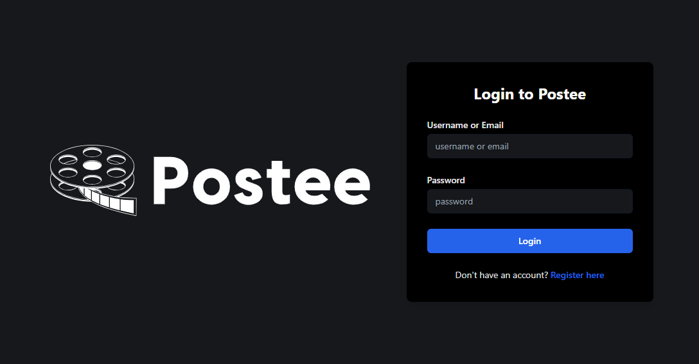
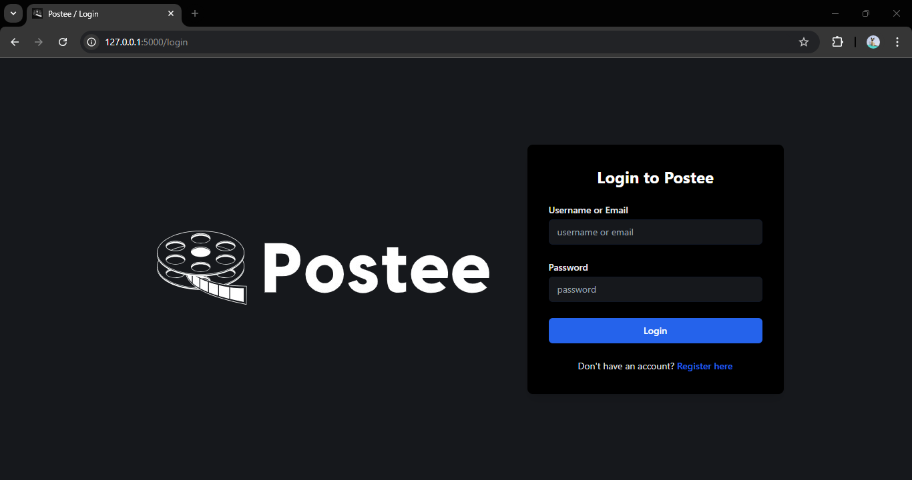
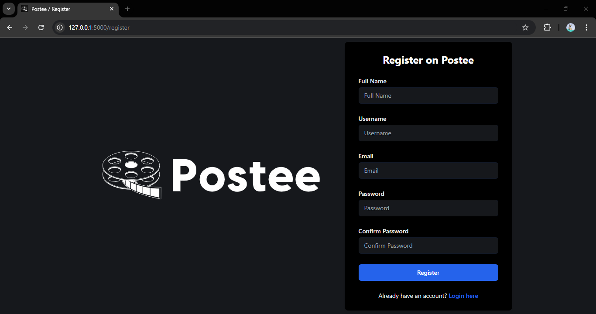
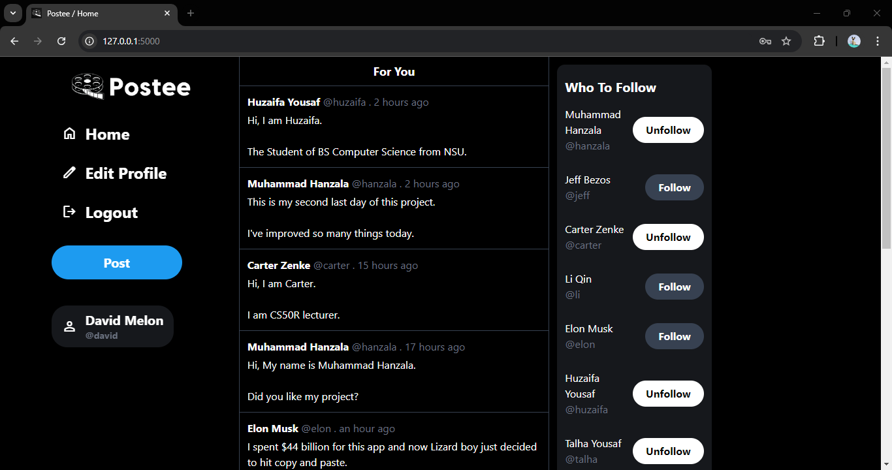
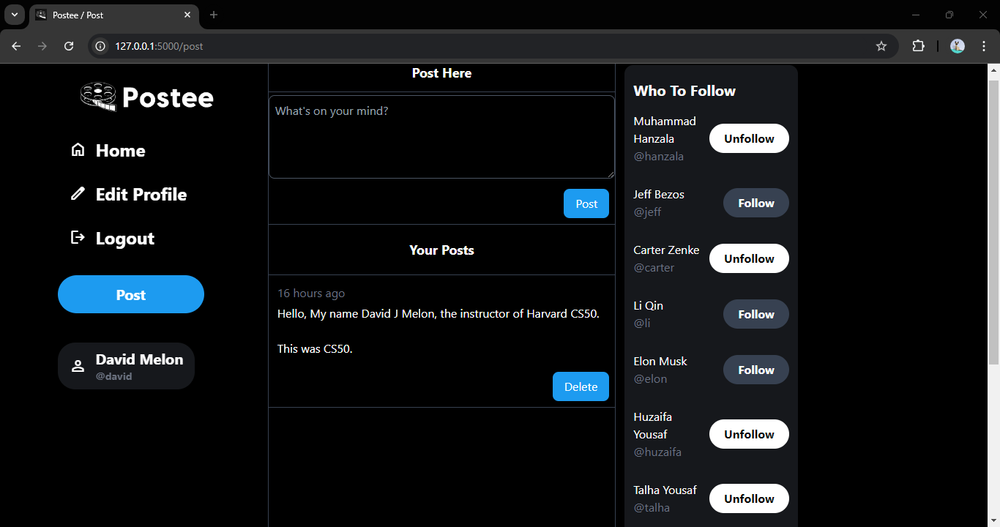

# Postee

#### Video Demo: 
<a href="https://youtu.be/BGdNbCRX53c">
  
</a>


## Description

Postee is a web application developed for the CS50X final project. It allows users to create, view, and manage posts, follow other users, and interact with a dynamic feed. The project demonstrates core concepts of web development including Flask, SQL, and Tailwind CSS. 

**Key Features:**
- **User Authentication:** Secure login and registration.
- **Post Creation and Management:** Create and delete posts with timestamps.
- **Follow/Unfollow Functionality:** Follow other users and manage your follow list.
- **Profile Editing:** Edit your profile by changing full name, email, and username.
- **Dynamic Feeds:** See posts from both followers and non-followers with a priority given to followers' posts.
- **Responsive Design:** A responsive layout that adjusts based on screen size.

### Files

- `app.py`: Main Flask application file, handling routes, authentication, and database operations.
- `templates/`: Contains HTML templates for rendering pages.
- `static/`: Holds CSS, JavaScript, and image files.
- `requirements.txt`: Lists Python dependencies for the project.
- `README.md`: This file.

### Installation

1. **Clone the Repository:**

    ```bash
    git clone https://github.com/mhanzalayousaf/postee.git
    ```

2. **Navigate to the Project Directory:**

    ```bash
    cd postee
    ```

3. **Set Up a Virtual Environment:**

    ```bash
    python -m venv venv
    source venv/bin/activate  # For Windows, use `venv\Scripts\activate`
    ```

4. **Install Dependencies:**

    ```bash
    pip install -r requirements.txt
    ```

5. **Run the Application:**

    ```bash
    flask run
    ```

### License

This project is licensed under the MIT License. See the [LICENSE](LICENSE) file for details.

### Acknowledgements

- **CS50** for providing the course and resources.
- **Tailwind CSS** for the excellent utility-first CSS framework.
- **Flask** for being a powerful yet simple web framework.

---

**Screenshots:**

1. Login Page:
   

2. Registration Page:
   

3. Home Page:
   

4. Post Creation:
   

